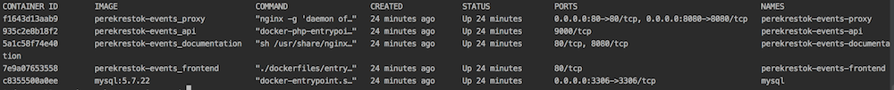

# Общее описание

Данный моно репозиторий включает в себя 5 обособленных компонентов системы:
* *api* - API сервер реализованный на основе фреймворка Laravel 5.7
* *api_documentation* - сервер API документации на основе Swagger спецификации
* *client* - клиентской frontend приложение на базе фреймворка VueJS
* *proxy* - реверсивный прокси сервер на базе nginx для маршрутизации внешнего http траффика на *api*,*documentation* и *client* компоненты

## Требования
* git
* GNU make
* docker ^18.03-ce stable - [how to install](https://docs.docker.com/install/)
* docker-compose ^1.22  stable - [how to install](https://docs.docker.com/compose/install/)

## Установка

> убедитесь, что порты 80/8080 не заняты!

```bash
$ git clone git@github.com:codenetix-ltd/perekrestok-test-app.git .
$ make build # сборка образов
$ make up # запуск
$ docker ps 
```
В случе успеха команда выдаст похожий результат:


Сервер приложения будет доступен по URL [http://localhost](), а документация по [http://localhost:8080]()

### Запуск дополнительных команд и утилит

* `$ make up_local` запуск локальной версии проекта с монтированием директорий проекта на хост машину
> после такого запуска будет необходимо вручную запустить `composer install` и `npm run build` в *api* и *client* соответствуеено
* `$ make api_code_check` - запуск codestyle linter. Описание стандарта кода находятся в файле `phpcs.xml`
Пример:
```
docker exec -it perekrestok-events-api ./vendor/bin/phpcs --standard=./phpcs.xml
............................................................ 60 / 74 (81%)
..............                                               74 / 74 (100%)
```

* `$ make api_code_fix` - фиксер

* `$ make phpunit` - тесты
```
docker exec -it perekrestok-events-api ./vendor/bin/phpunit tests/Feature
PHPUnit 7.3.2 by Sebastian Bergmann and contributors.

..........                                                        10 / 10 (100%)

Time: 4.25 seconds, Memory: 20.00MB

OK (10 tests, 37 assertions)

```
* `$ make api_test_coverage` - покрытие кода
```
docker exec -it perekrestok-events-api ./vendor/bin/phpunit tests/Feature --coverage-html tests/_reports/coverage
PHPUnit 7.3.2 by Sebastian Bergmann and contributors.

..........                                                        10 / 10 (100%)

Time: 10.12 seconds, Memory: 24.00MB

OK (10 tests, 37 assertions)
```

### Описание деталей реализации API компонента системы

#### Идеалогия
В основе разработки лежат:
* TDD
* API First (у меня даже статейка есть про это [https://habr.com/post/419525/]()
* SOLID в самом его лучшем проявлении. Слабая связанность - залог успешной масштабируемости проекта

#### Структура

Логические точки входа в проект:
* `app/Http/Controllers/EventController` - API контроллер event ресурса
* `app/Console/Commands/PullEvents` - команда c CLI для обращения и вытягивания событий из удаленного микросервиса с последующей конвертацией и сохранением в БД
* `app/Console/Commands/PushEvents` - команда с CLI для отправки 'дайджестов?' событий в удаленную систему (фактически просто для отправки событий, но переделать можно легко и просто ибо все слабосвязанно)
* `app/Services/Clients` - клиенты для взаимодействия с внешними микросервисами: получение пользователей, получение эвентов, отправка эвентов (очень рекомендую ознакомитсья!)
* `app/Providers/AppServiceProvider` - биндинги интерфейсов на реализации. Куда еще больше гибкости? :)

#### Конфигурация и использование

##### EventController

Представляет Controller уровень MVP парадигмы. Основная задача: получение данных от клиента, делегирование для последующей обработки на уровень бизнес логики системы (services), получение результата, формирование ответа (через Resources)).

##### PullEvents

Запуск команды:
```
$ make pull_events
```
Пример результата
```
26 new events has been imported
```
###### Детали работы:
Использует для коммуникации с внешним источником событий абстракцию `EventExternalServiceClientInterface`. Для тестирования был разработан 
mock класс `EventExternalServiceClientMock`, который имитирует получение событий из внешнего источника путем чтения локального файла. Путь к файлу задается в конфиге `config/mock.php -> filePathWithFakeEvents` 
Замена реализации абстракции осуществляется путем ребиндинга в файле `AppServiceProvider`:
```
...
$this->app->bind(EventExternalServiceClientInterface::class, EventExternalServiceClientMock::class);
...
```
по схожему принципу работает клиент источника пользователей `UserExternalServiceClientInterface`. Его mock `UserExternalServiceClientMock` реализует метод `public function getUserById(int $id): ExternalUser` в соответствии с примером из ТЗ.
Биндинг:
```
...
$this->app->bind(UserExternalServiceClientInterface::class, UserExternalServiceClientMock::class);
...
```

##### PushEvents

Запуск команды:
```
$ make push_events
```
Пример результата:
```
23 new events has been pushed into external system (Bitrix?)
```
###### Детали работы:
Использует для отправки во внешний приемник событий абстракцию `ExternalEventSubscriberClientInterface`. Для тестирования был разработан 
mock класс `ExternalEventSubscriberClientMock`, который имитирует отправку событий во внешний сервис, но фактически пишет результат `print_r` в файл из конфига `config/mock.php -> filePathWithEventSubscriberLog` 
Замена реализации абстракции осуществляется путем ребиндинга в файле `AppServiceProvider`:
```
...
$this->app->bind(ExternalEventSubscriberClientInterface::class, ExternalEventSubscriberClientMock::class);
...
```

#### Как же запускать по CRON?

По скольку мы используем docker, а как известно, запуск cron задач внутри контейнера является крайне дурным тоном, поэтому необходимо настроить crontab на хост машине c правилами
```
*/5 * * * * make pull_events
*/5 * * * * make push_events
```
... а вообще круто бы было использовать kubernetes с его специальными `jobs`

### Немного про frontend

Я довольно неплохо знаю `nodejs` и `typescript`, но сам по себе фронтенд не мой конек. Для этого приложения выбрал VueJS и использовал как каркас [https://github.com/petervmeijgaard/vue-2-boilerplate]() 
Выводы делайте сами :)

## Заключение

> Задался целью сделать хорошо - показать свой максимум, но получилось как всегда - не хватило времени (особенно на фронт), а тут еще и требования по железу/ПО вылезли под конец... 

Я профессиональный backend разработчик и архитектор, ex CTO компании [http://codenetix.com](), команду разработчиков, которой собрал сам. Результат полученного опыта меня и моей команды за последние 3 года  позволил проделать огромную работу по организации структуры проекта за очень короткий срок. Итог: за бакенд не стыдно, а фронт бы еще доделал/переделал.